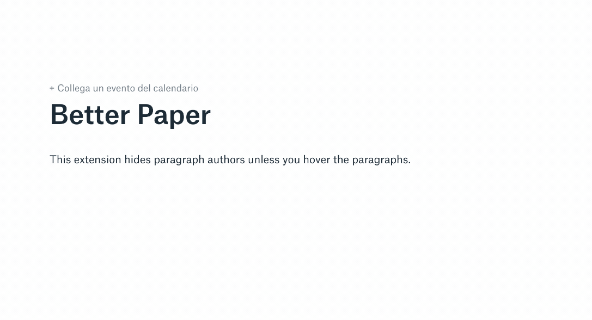

Better Paper - Chrome Extension
======================

This Chrome extension makes [Dropbox Paper](https://paper.dropbox.com) more minimal by hiding **paragraph authors** and **task assignees** unless you hover them.

[Say Hi on Twitter](https://www.twitter.com/linuz90) for feedback or feature requests.

Platform: macOS, Windows.

## Preview

### Instructions

1. Launch Chrome
2. Go to Extensions (`chrome://extensions/`)
3. Toggle `Developer mode`
4. Click `Load unpacked extension`
5. Select `src` folder from this repository
6. Visit [paper.dropbox.com](https://paper.dropbox.com), open or create a document and enjoy a minimalist experience

### Release notes 

| Version | Notes |
| --- | --- |
| v.0.1 | Initial Version. | 
